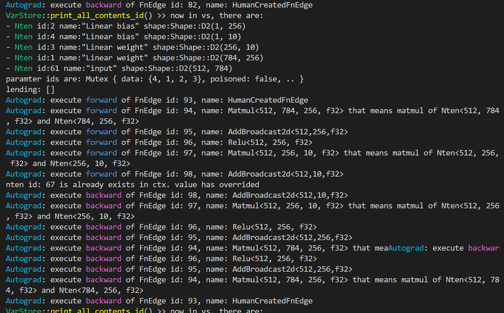

# Welcom to Rusty Lantern Dev !

Rusty Lanternはクロスプラットフォームで型安全な次世代のMLライブラリです。このリポジトリでは開発中のLanternのデモを示します。


## MNISTの学習デモ

**コードはこちら**

[./example.rs](./src/example.rs)

実行したい場合は
```
cargo run --release
```
で実行できます。

**実行結果の例**
```
load_minst: number_of_images = 60000, number_of_rows = 28, number_of_columns = 28
num of data is '60000'
start learning
epoch 1 loop 0, Loss: 2.3083217, acc: 14.45%
epoch 1 loop 10, Loss: 1.9896543, acc: 38.67%
epoch 1 loop 20, Loss: 0.71853524, acc: 75.39%
epoch 1 loop 30, Loss: 0.82790333, acc: 69.73%
epoch 1 loop 40, Loss: 0.5680679, acc: 83.59%
epoch 1 loop 50, Loss: 0.32513517, acc: 90.82%
...
epoch 10 loop 30, Loss: 0.02845507, acc: 99.61%
epoch 10 loop 40, Loss: 0.030548083, acc: 99.41%
epoch 10 loop 50, Loss: 0.030155195, acc: 99.41%
```
誤差を示すLossは低下し，正解率を示すaccが上昇していく様子がわかります。
>ただし，本プログラムはニューラルネットワークの学習が行えることを簡潔に示すためのものであるため，正解率はテストセットではなく学習データに対して求めています。

**デバッグ出力**

ループの最初にVarStoreの中身（Nten）を出力しています。
その後，自動微分の実行者であるAutogradがforwardパスとbackwadパスを順に行っていることがわかります。Autogradでは計算グラフの行列の形状を把握しているため問題の特定が素早くできます。



## main.rsでは開発過程で少しずつ動作検証をした過程を残してあります。

- fn raw_add()

単純な足し算です。lanternでは様々な数値型，GPU，疎行列等に対応するため
抽象化レイヤーが入っているので，ここがまず動くことを確かめます。

- fn nten_add()

自動微分可能な行列形式Ntenのテストおよび，自動微分機構のAutogradの動作テストです。

- fn matmul()

行列積の自動微分です。

- fn mnist()

デバッグ用なのでMNISTの学習デモは./example.rsを見てください。
実際のデータセットを使って学習ができることを示しました。ここでは，データセットの作成，
NNレイヤーの構築，学習のループとモデルパラメーターの更新，結果の評価を行いました。